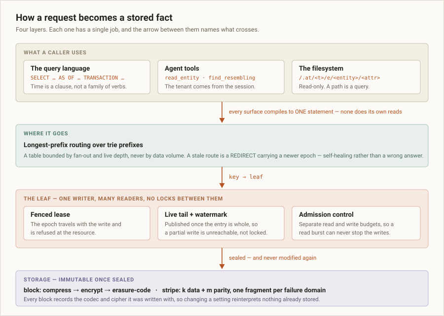
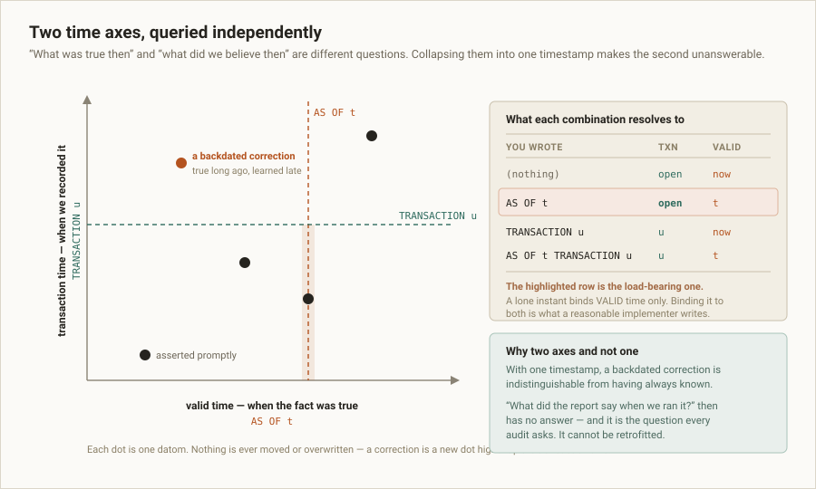
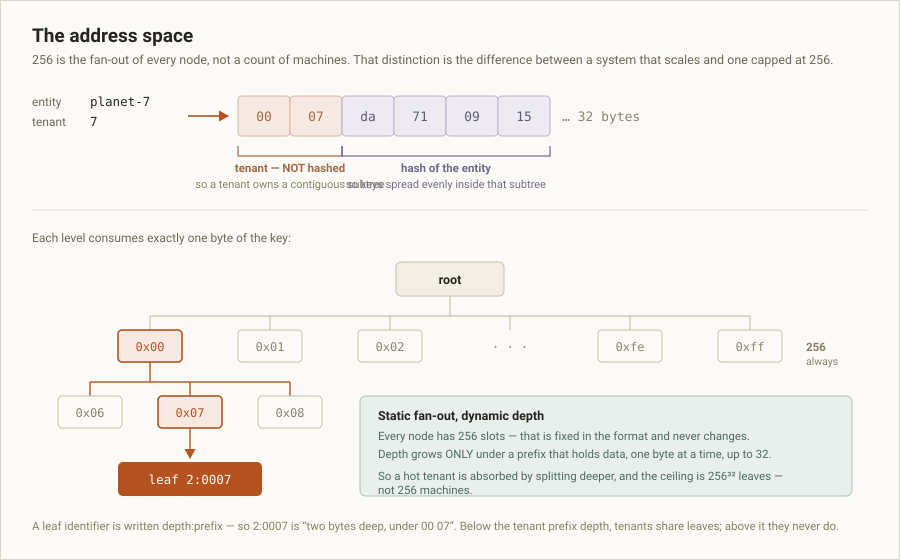
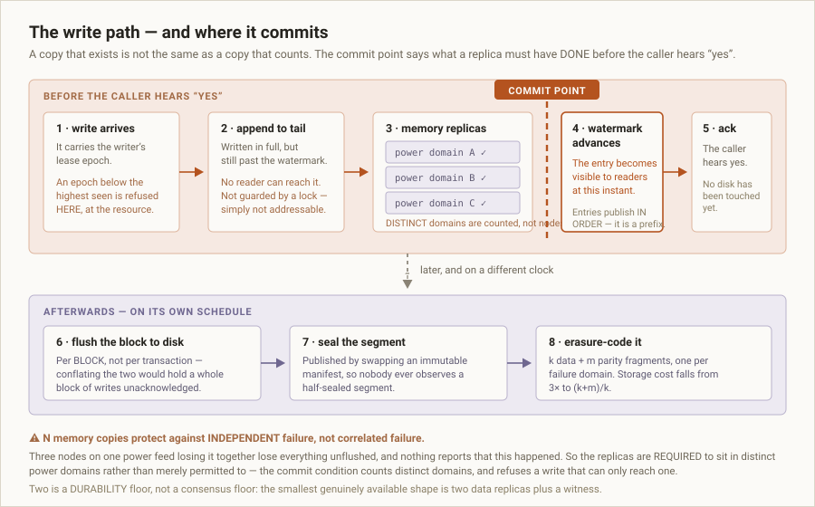
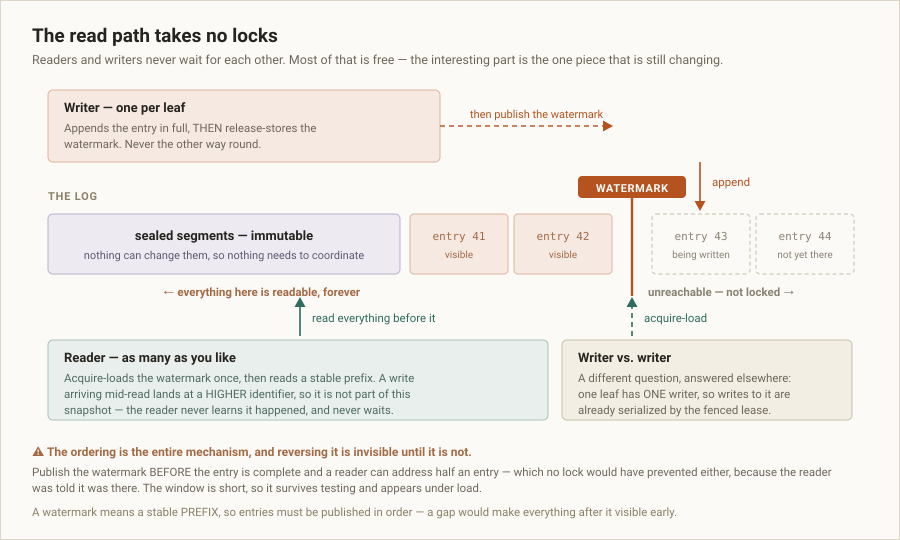
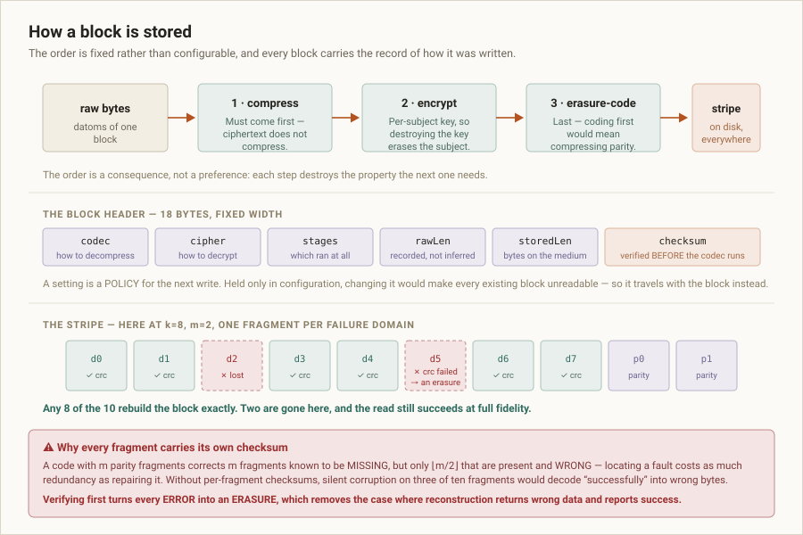
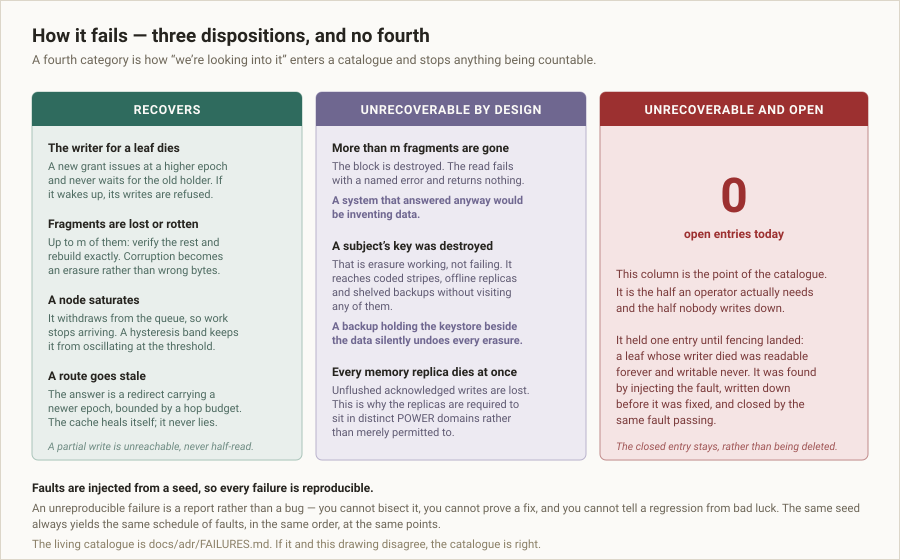

# sdev1

A **planetary-scale structural data engine**, written in Go.

Facts are stored as EAVT datoms on two independent time axes, written through a
CQRS command path onto an append-only log, and served from read models with their
own shapes. The key space is a trie of 256-way fan-out. Storage is a binary
segment format; sealed segments are erasure-coded; live segments are replicated
whole under per-shard leader election.

Nothing is ever overwritten. A correction is a new fact, so "what was true then"
and "what did we believe then" stay separately answerable — forever.

---

## Quick start — create records, read them back, search them

Go 1.26 or newer. No server to start, nothing to configure.

```bash
git clone git@github.com:atvirokodosprendimai/sdev1.git
cd sdev1

go run ./cmd/sdev1-ql \
  --statements "ASSERT planet-7 name = 'Kepler-7b'" \
  --statements "ASSERT planet-7 class = 'gas giant' VALID FROM 100" \
  --statements "ASSERT planet-7 description = 'a hot inflated giant'" \
  --statements "ASSERT planet-9 name = 'Kepler-9c'" \
  --statements "ASSERT planet-9 class = 'gas giant'" \
  --statements "ASSERT planet-9 description = 'a cool distant giant'" \
  --statements "READ * FROM planet-7" \
  --statements "READ * FROM planet-7 AS OF 50" \
  --statements "SEARCH 'giant' IN description FACET BY class LIMIT 5" \
  --statements "RETRACT planet-7 class = 'gas giant'" \
  --statements "READ class FROM planet-7"
```

Abridged output — the writes echo back, then:

```
READ * FROM planet-7
  planet-7   class        gas giant
  planet-7   description  a hot inflated giant
  planet-7   name         Kepler-7b

READ * FROM planet-7 AS OF 50
  no rows

SEARCH 'giant' IN description FACET BY class LIMIT 5
  1. planet-7     score 3.219
  2. planet-9     score 3.219
  facet class (2 matched)
    gas giant      2

RETRACT planet-7 class = 'gas giant'
  retracted  planet-7 class = gas giant
  valid   [1788555023240962263, ∞)
  txn     1788555023240962263.0@1:00#7

READ class FROM planet-7
  no rows
```

Four things in that transcript are the whole design, working:

- **`AS OF 50` returns nothing.** The `class` fact was asserted `VALID FROM 100`,
  so at instant 50 it had not started being true. Time travel is a clause, not a
  separate verb.
- **The transaction identifier is assigned by the system**, and you cannot state
  it. `VALID FROM 100` backdates when the fact was *true*; nothing backdates when
  it was *recorded*.
- **`RETRACT` does not delete.** It appends a datom that stops the fact holding —
  which is why the last `READ` returns nothing while the log still has every
  version.
- **The search index was fed by the writes**, not by anything separate, and the
  facet counts only what a caller can actually see.

Statements also come from a file (`--file`) or standard input. Add `--tenant N`
to write into a different tenant's subtree.

> ★ **Add `--dir` and the facts stay.** `sdev1-ql --dir ./leaf` keeps the leaf in a
> directory, so a fact written by one run is read by the next:
>
> ```
> sdev1-ql --dir ./leaf --statements 'ASSERT planet-3 mass = "5.97e24"'
> sdev1-ql --dir ./leaf --statements 'READ * FROM planet-3'
>   planet-3   mass         5.97e24
> ```
>
> ⚠ Without `--dir` everything is held in memory and lost on exit. And even with
> it, what is written since the last seal is in memory — an acknowledged write is
> held by replicas, not by a disk, which is a decision rather than an oversight.

## What you can actually do today

**Short version: you can write facts, read them back at any instant, filter,
search, traverse links, keep all of it on a disk across restarts, and now READ
ONE OVER A SOCKET — from a node that redirects you if it is not the one holding
what you asked for. What is missing is a networked write, a planner, and
everything that needs one.**

| | Status | What that means |
|---|---|---|
| `READ … FROM … WHERE … AS OF … TRANSACTION …` | **runs** | Against a session or a leaf. ⚠ `WHERE` **filters** — until ADR-027 it parsed and was discarded, so a narrow question got a wide answer with no error. A comparison is numeric only when the literal was written as one. |
| `MATCH SHAPE LIKE … REQUIRE … OPTIONAL … SIMILARITY …` | **parses, refused by name** | Per-leg time qualifiers work. It needs a similarity metric, and one chosen against no corpus is a number nobody has reason to believe. |
| `SEARCH … IN … FACET BY … LIMIT …` | **parses + runs** | Against an **in-memory** index: real ranking, real facets, erasure honoured. Not persisted. |
| Backtick-quoted identifiers — `` `limit` `` | **works** | Any keyword is addressable as an attribute name. |
| Placing an entity in the trie | **runs** | `cmd/sdev1-addr`, end to end, no network. |
| `ASSERT … VALID FROM … TO …` / `RETRACT …` | **parses + runs** | Creates and retracts facts in the in-memory session. Valid time is yours; **transaction time is never** — stating it is a parse error. |
| Reading a fact back, at any instant | **runs** | `READ … AS OF …` against the session, through the real visibility predicate. |
| **`INSERT` / `UPDATE` / `DELETE`** | ❌ **will never exist** | The store appends. An update is an assertion, a delete a retraction, an erasure a destroyed key. |
| Links — `ASSERT a orbits = ->b` | **parses + runs** | A value prefixed `->` is a reference, stored as a kind and never inferred from bytes. |
| Taxonomies at a past instant — `TRAVERSE a DEPTH 2 AS OF t` | **parses + runs** | Free once links are datoms. ⚠ **Every hop resolves at one instant** — otherwise you get a tree that never existed. |
| **Joins, `AND`/`OR`, `ORDER BY`, `COUNT`** | ❌ | See the query guide's boundary table for which are decisions and which are gaps. |
| Writing a segment to a disk, reading a block back | **runs** | `internal/core/segstore`. Published by atomic rename, so a half-written segment is not addressable rather than being guarded; index verified before any offset from it is followed; the file is read through a memory mapping. macOS and Linux. |
| A fact you `ASSERT` surviving a restart | **runs** | `sdev1-ql --dir ./leaf`, twice. A leaf is a directory of segments; a read merges them by the datoms' own transaction identifiers, so ⚠ **renaming the files does not change the answer**. |
| Reading a stored fact back | **runs** | `READ` evaluates against any `ports.Reader`, so the same statement answers from memory or from a leaf, costing one entity read either way. |
| A read over a network | **runs** | `cmd/sdev1-serve` puts a leaf behind a socket and `serve.Client` reads it. ★ A request names a **key**, never a leaf, so a node that does not hold it computes where it went and redirects — and the client repairs its own map from the node that was wrong. |
| A write over a network | ❌ **refused by name** | Not an empty answer, which a client would read as "it ran and matched nothing". There is no leader to fence one (ADR-009) and no durability tier to commit it at (ADR-020). |
| Authentication, TLS, pooling | ❌ | ⚠ **Nothing authenticates.** Anyone who can reach the socket reads any leaf that node holds. One request per connection, closed after. Do not expose this to a network you do not own. |
| A cluster that places or replicates | ❌ | Routes are configured per node with `--route`; nothing distributes them, nothing elects, nothing replicates. |

→ **[How to query, with the full grammar and worked examples](docs/QUERY-LANGUAGE.md)**
→ **[What is next, ordered by what blocks what](TODO.md)**

## Where this actually is

Read this before anything else on the page.

**The decisions are made and recorded. Much of the machinery that would execute
them is not built.** Forty-five decision records are Accepted, each governs real
Go code, and all 36 packages that carry tests pass under the race detector. A
fact survives a process, and a read now crosses a network — but a WRITE does not,
so **you can start a server and read a fact through it, and you cannot yet store
one through it.**

| | |
|---|---|
| **Runs today** | 38 Go packages, 445 tests, race-clean — 36 packages carry tests, and the two that do not are the commands, each proved by RUNNING the built binary rather than by compiling it. ★ `cmd/sdev1-serve` is started **twice, as two real processes**, and a redirect is followed between them: a build would have proved only that `main` compiles, and the flag names, `--leaf` parsing and `--route` spelling could each have been wrong and still built clean. Three binaries: `sdev1-addr`, `sdev1-ql` and `sdev1-serve`. |
| **Exists now** | A storage engine, an evaluator, and a transport: facts encoded into blocks, blocks into segments published by rename, segments into a leaf, a `READ` that reads one entity out of it and filters — and a socket that serves that read or redirects to the node that can. |
| **Does not exist** | A networked write, a query planner, a similarity metric, authentication, a running cluster that places or replicates anything. |
| **Honestly measured** | 323 mutants killed across the corpus, 23 recorded as *survived*. ★ Those rows are kept rather than deleted even after the test that let one through is strengthened — a mutant that lived is the record of what the suite could not see. Seven found claims that nothing was holding: one was a real bug, and two showed claims **no test in this design can falsify**, which were withdrawn or marked unprovable rather than propped up. |

What that buys: every rule below is *checkable now*, with no cluster, and the
hard decisions — the ones that cannot be retrofitted once data exists — are
settled before there is data to migrate. What it costs: this is a design and a
proof of its parts, not a database you can run.

`docs/adr/README.md` says which half of each record is built.

---

## The shape of it



Four layers, each with one job:

1. **Surfaces** — the query language, agent tools, a filesystem. Every one of
   them compiles to a single query statement. None does its own reads.
2. **Routing** — longest-prefix over trie prefixes. A stale route is a redirect,
   never a wrong answer.
3. **The leaf** — one fenced writer, many readers, no locks between them.
4. **Storage** — immutable once sealed, erasure-coded, self-describing.

---

## The data model

### Datoms

A fact is a four-tuple: **entity, attribute, value, transaction** — a *datom*.
Nothing else is stored, and nothing is ever mutated. Changing an address means
asserting a new datom; deleting one means asserting a retraction. The log only
grows.

That choice is what makes every other property on this page possible. A store
that overwrites cannot answer a question about the past, and no amount of
auditing bolted on afterwards recovers what was overwritten.

### Two time axes



Every datom sits at a point on two axes:

- **Valid time** — when the fact was true in the world.
- **Transaction time** — when this store learned it.

A backdated correction is low on the first axis and high on the second. With one
timestamp it would be indistinguishable from having always known — and *"what did
the report say when we ran it?"* would have no answer. That is the question every
audit asks, and it cannot be retrofitted.

The two are queried independently, and the defaults are one table:

| you wrote | transaction axis | valid time |
|-----------|------------------|------------|
| *(nothing)* | open | now |
| `AS OF t` | **open** | `t` |
| `TRANSACTION u` | `u` | now |
| `AS OF t TRANSACTION u` | `u` | `t` |

⚠ The second row is load-bearing. A lone instant binds valid time and leaves the
transaction axis **open**. Binding one value to both is what a reasonable
implementer writes by default, and it answers a different question than the one
asked.

### Transaction identity

A transaction is identified by a hybrid logical clock reading, the leaf it was
written on, and a sequence number. Together those give a **total order across the
whole cluster** without a global clock and without a coordinator. Wall-clock
skew cannot reorder two transactions, and two leaves writing at the same instant
never collide.

---

## The address space



A key is 32 bytes: the **tenant** in the leading two, unhashed, then a hash of
the entity. Each level of the trie consumes exactly one byte.

**256 is the fan-out of every node — not a count of machines.** That distinction
is the whole decision. Fixing 256 as a shard *count* caps the system at 256
machines forever, and the cap is encoded in every key ever written, so it is
discovered only once migrating is expensive.

- **Fan-out is static.** 256 slots per node, fixed in the format.
- **Depth is dynamic.** It grows only under prefixes that hold data, one byte at
  a time, up to 32. A hot region is absorbed by splitting deeper.

The ceiling is 256³² leaves. The tenant prefix means a tenant owns a **contiguous
subtree**, which turns tenant deletion into a subtree drop, data residency into a
placement rule, and per-tenant durability, retention, compression and erasure-key
namespaces into subtree policy.

The topology is described over the levels **universe, planet, datacenter, rack,
server, disk**, held as a nested set, so "spread these copies across distinct
racks" is a range comparison rather than a tree walk.

---

## The write path



A write carries the writer's **lease epoch**. It is appended to the live tail —
complete, but still past the watermark, so no reader can reach it. It is then
replicated **into memory** on nodes in distinct power domains. When enough
distinct domains hold it, the watermark advances past it, and *that* is the
commit point. The caller hears "yes" before any disk has been touched.

Three things about that are deliberate:

**The watermark IS the commit point, not a second mechanism beside it.** The
watermark already makes an in-flight entry unreachable rather than half-visible,
so advancing it once the replicas hold the entry gives atomicity for readers with
nothing new added.

⚠ **N memory copies protect against *independent* failure, not *correlated*
failure.** Three nodes sharing one power feed lose everything unflushed together,
and nothing reports that this is the situation. So the replicas are **required**
to sit in distinct power domains rather than merely permitted to, and a write
that can only reach one domain is refused.

⚠ **Replication and flushing are different granularities** — per transaction and
per block. Conflating them holds a whole block's worth of writes unacknowledged
and spikes latency at every block boundary.

Two is a **durability** floor, not a consensus floor: two voting members give a
quorum of two, so a bare pair is *less* available than a single node. The
smallest genuinely available shape is two data replicas plus a witness.

## The read path



**Readers and writers never block each other.** Most of that is free: sealed
segments are immutable, so reading them needs no coordination at all, and a
concurrent write lands at a *higher* transaction identifier and is simply not
part of an earlier snapshot.

The live tail is the only mutable part, and it is the whole decision. A writer
appends the entry in full and *then* release-stores the watermark. A reader
acquire-loads the watermark and reads the stable prefix before it.

⚠ **A partially written entry is unreachable, not guarded.** There is no lock to
contend on. Reverse the ordering — publish the watermark before the entry is
whole — and a reader can address half an entry, which no lock would have
prevented either, because the reader was *told* it was there. The window is
short, so it survives testing and appears under load.

A watermark means a stable **prefix**, so entries publish in order. Sealing
publishes by swapping an immutable manifest, so nobody ever observes a half-sealed
segment.

Writer-versus-writer is a different question, answered by the lease: one leaf has
one writer.

---

## Storage



**The pipeline order is a consequence, not a preference.** Each step destroys the
property the next one needs: encrypting first would leave nothing compressible,
and coding first would mean compressing parity.

**Every block records how it was written** — codec, cipher, which stages ran, its
true length, and a checksum. Held only in configuration, changing a setting would
reinterpret every block already on disk. A constant that is safe as a *policy* is
fatal as a *format assumption*, and the fix is always the same: put it in the
header.

The checksum is verified **before** the codec runs, and decoding takes no
configuration — it reads what the header says.
### A segment on a disk

★ **The question a segment file answers is not what it looks like but WHEN IT
EXISTS.** Sealed data is immutable, which is what lets the read path take no
locks — and a file being written under its final name is a half-sealed segment,
visible to anyone who lists the directory. So the blocks go to a temporary name in
the same directory, and the rename is the publication. Everything before it is
invisible.

The index is written after the blocks, and a fixed-width trailer after that: one
seek to the end finds it whatever the segment's size. ⚠ **A crash therefore leaves
a file that is not a segment rather than a broken one** — "incomplete" can be
deleted without judgement, "corrupt" needs a human, and the trailer is what tells
them apart.

⚠ **An index is a list of byte offsets, so a wrong one does not fail.** It reads
arbitrary bytes, and arbitrary bytes are indistinguishable from a block until the
block's own checksum says otherwise. Everything the index claims is checked before
any offset from it is followed: its checksum, its bounds, that it is sorted, and
that the header's block count agrees with it.

Reading maps the file, because a sealed segment never changes and any number of
readers can share one mapping with no coordination. Two prices are paid for that
and both are written down rather than discovered during an incident: an I/O error
on a mapped page arrives as a SIGBUS instead of an error return, and a block handed
back must be **owned** — a view into the mapping is a dangling pointer the instant
the reader closes, and it behaves perfectly until then.

A missing key is a named refusal, never an empty block: a caller that treats
absence as emptiness writes over a fact it never read.

### Erasure coding

A sealed block becomes a stripe of `k` data and `m` parity fragments, one per
failure domain, at `(k+m)/k` storage cost instead of 3×. Any `k` of them
reconstruct the block exactly.

⚠ **A code with `m` parity fragments corrects `m` fragments known to be MISSING,
but only ⌊m/2⌋ that are present and WRONG.** Locating a fault costs as much
redundancy as repairing it. So every fragment carries its own checksum and is
verified before decoding — which turns every *error* into an *erasure*, and
removes the case where reconstruction returns wrong bytes while reporting success.

The scheme travels with the stripe, so changing the configured one is safe at any
time.

### Erasure of a subject

Append-only storage cannot delete. Erasing a subject is the destruction of its
per-subject key — which reaches a coded stripe spread over ten domains, a replica
that has been offline for a month, and a backup on a shelf, without finding,
visiting or rewriting any of them.

⚠ **The ciphertext is permanent, and so is anything sitting beside it.** A key
handle *derived* from the subject would be an un-erasable identifier for that
subject, confirmable by anyone who could guess it. So handles are allocated random
bytes, and the mapping is destroyed with the key.

⚠ **A backup that holds the keystore alongside the data silently undoes every
erasure it contains.**

---

## The query language

One idea: **time is a clause, not a family of verbs.** There is no
`READ_HISTORY` and no `AS_OF_READ` — there is `READ`, and it may carry a
time qualifier.

The verb is `READ` rather than `SELECT` (ADR-034): the store appends, so there is
no `INSERT`, `UPDATE` or `DELETE` for `SELECT` to be a sibling of, and a borrowed
word that implies three verbs which will never exist teaches the wrong model at
the first token. `SELECT` is still **reserved**, so typing it is refused by name
rather than failing somewhere inside the projection:

```sql
SELECT * FROM planet-7             -- refused: SELECT was renamed to READ
```

**Every form the language accepts, in full.** There are three statements and one
standalone clause — that is the whole surface:

```sql
-- Read an entity. `*` is every attribute.
READ * FROM planet-7
READ mass, radius FROM planet-7
READ name FROM planet-7 WHERE class = 'terrestrial'
READ * FROM planet-7 WHERE mass >= -40.5

-- Read a TABLE: the entities that point AT one. `->a` is a member's attribute.
READ ->name FROM [staff]
READ ->name, ->lastname FROM [staff] WHERE ->lastname = 'Adams'
READ * FROM [staff] LIMIT 20 OFFSET 40 AS OF 1700000000

-- Absence is its own clause, so "has this and lacks that" needs no AND.
READ ->name FROM [staff] WITHOUT ->thirdname
READ ->name FROM [staff] WHERE ->rank = 3 WITHOUT ->thirdname
READ * FROM planet-7 WITHOUT radius

-- Time travel. Two independent axes.
READ * FROM planet-7 AS OF 1700000000                       -- valid time
READ * FROM planet-7 TRANSACTION 1700000500                 -- transaction time
READ * FROM planet-7 AS OF 1700000000 TRANSACTION 1700000500

-- Find subjects that resemble one. Metric and threshold are required.
MATCH SHAPE LIKE planet-7
  REQUIRE mass AS OF 1700000000, radius
  OPTIONAL nickname
  WITHOUT retired
  SIMILARITY jaccard >= 0.8

-- Full-text search. LIMIT is required.
SEARCH 'red dwarf' IN description LIMIT 20
SEARCH 'red dwarf' IN description, notes
  FACET BY class, discovered_by
  LIMIT 20
  AS OF 1700000000

-- Any keyword is addressable as an attribute name.
READ `limit`, `in` FROM planet-7

-- A storage policy for the NEXT write. Parsed standalone; no write statement
-- exists to carry it yet.
WITH COMPRESSION zstd
```

```sql
-- Create and retract facts. Valid time is yours; transaction time is never.
ASSERT planet-7 mass = 5972
ASSERT planet-7 class = 'terrestrial' VALID FROM 100
ASSERT planet-7 class = 'terrestrial' VALID FROM 100 TO 200
RETRACT planet-7 class = 'terrestrial' VALID FROM 500
```

```sql
-- Links. `->` makes a value a reference to another entity, not text.
ASSERT planet-7 orbits = ->star-1
ASSERT planet-7 note = 'star-1'

-- Walk them, as the graph stood at an instant.
TRAVERSE planet-7 DEPTH 2
TRAVERSE planet-7 DEPTH 2 AS OF 1700000000
```

The two `ASSERT`s above write the same nine characters and mean different things.
⚠ **The kind is how it was written, never a guess from the bytes.**

Run any of the above with `cmd/sdev1-ql` — see the [quick start](#quick-start--create-records-read-them-back-search-them).

Because time is a clause, a **per-leg** qualifier costs nothing extra — match on
mass as it stood at one instant and nickname as it stood at another. Under a verb
family that would need a second grammar.

`REQUIRE` drops a row that does not match; `OPTIONAL` yields an **unbound** value
and keeps the row. Unbound is not the empty string — conflating them is how a
consumer reads "has no nickname" as "nickname is blank".

The metric and threshold are **required**, with no default: a default would make
every unqualified shape query reproducible only by whoever knew it.

**The language parses; nothing evaluates it yet.**

→ **[Full guide, grammar and tutorial: `docs/QUERY-LANGUAGE.md`](docs/QUERY-LANGUAGE.md)**

---

## Surfaces over the language

Two more ways in, and neither is a second way in. **Each compiles to a query
statement or it is not a surface** — a set of handlers that each reach storage
directly is a second query language with no grammar, a different time story per
handler, and the defaults table re-implemented once per site.

### Agent tools

An MCP surface whose caller is a model — the least forgiving caller there is,
because it has the tool list and nothing else. It cannot open the documentation,
read a changelog, or ask what an error meant.

- ⚠ **The tenant comes from the session, and a `tenant` argument is *ignored*,
  not rejected.** A rejection tells the caller the parameter exists. A model
  composes its next call from text it may have read out of this store, so the
  read itself is the injection vector.
- ⚠ **A refusal is a value, not an error.** A refusal in the error position is
  indistinguishable from a dropped connection, and the correct response to a
  dropped connection is to retry — so an agent retries it forever.
- **Time is an argument on every tool**, enforced at registration, which is what
  stops a `get_history` growing beside a `get`.
- **There is no `update` and no `delete`.** The harm is not at the API: a tool
  named for a verb this store does not have teaches a model a data model this
  system does not have, and the model then reasons about history and erasure
  wrongly — which nothing reports.

Read-only is a *consequence*, not a policy: the language has no write statement,
so there is nothing for a write tool to compile to.

### A filesystem

An entity is a directory, an attribute is a file, and an instant is a path prefix:

```
/e/planet-7/mass                        the value now
/.at/1700000000/e/planet-7/mass         the value as it stood then
```

Because the store is bitemporal and append-only, it is *already* a snapshotting
filesystem — so `cp -r /.at/<instant>/e /backup` is a point-in-time export, and
nothing involved had to learn anything about this system. That is the entire
reason to build it: a filesystem is a worse interface than the query language for
nearly everything, and it is the one interface tens of thousands of existing
programs already speak.

- ⚠ **Read-only, refused at `open` — never at `close`.** A program that opens for
  writing, buffers, and fails at `close(2)` has already lost the data, and many
  programs never check `close`. A directory opened for writing is `EROFS`, not
  `EISDIR`, because `EISDIR` would say that opening a *file* for writing would
  have worked.
- **Writes are not a missing feature.** POSIX cannot express that several
  attributes change together, and the entity is this store's transaction
  boundary. A writable projection would commit each `write(2)` as its own
  transaction and break that boundary *silently*, because every write succeeds.
- ⚠ **`mtime` is the datom's transaction time.** Callers read `stat` far more
  than contents — an mtime from the clock makes every file look modified on every
  pass, and every incremental backup silently becomes a full one.
- ⚠ **A shredded datom is `ENOENT`, identical to one that never existed.**
  `EACCES` would confirm the subject existed, which is an oracle anyone could
  query by guessing a name.

---

## Search and faceting

Everything above requires already knowing what you are looking for: `READ`
reads a **named** entity, and `MATCH SHAPE` needs a subject to resemble. Search
is how you ask without knowing, and faceting is how you ask what the matches look
like in aggregate.

One fact shapes the entire design.

⚠ **An ordinary inverted index silently undoes crypto-shredding.** Erasure works
because destroying a subject's key leaves ciphertext that nothing can read — an
argument that holds *only* while nothing readable sits beside it. An index is
extracted plaintext. Shred the key and the segments go dark while the index still
answers `term → subject-42`, which turns the fastest structure in the system into
a lookup for the person somebody asked to erase. And it cannot be fixed later:
every posting already written would already be in the clear, in every replica and
every backup of the index.

So **a posting is sealed with the subject's own key.** Shredding makes it
undecryptable everywhere at once — live index, replicas, backups — without
anything having to go and find them. Erasure reaches the index by exactly the
argument that makes it reach a coded stripe.

- ⚠ **A posting that does not decrypt is *absent*** — never an error, and never a
  withheld count. "3 results hidden" is the same existence oracle wearing a
  different hat, and `withheld++` is what anyone writes when a decrypt fails
  inside a loop. The function that filters them returns no second value, so it
  structurally cannot report one.
- **Deleting a shredded subject's postings is not the answer**, though it looks
  sufficient — it reintroduces a deletion that must find and visit every copy,
  and an offline replica keeps its own.
- **The index is derived and the log wins.** A result is a *candidate*, confirmed
  against the datoms before it is returned; an index fed by subscription is
  always behind. It is rebuildable from the log, so losing it is a performance
  event rather than a data-loss event.
- **Postings carry the transaction range they held over**, so search inherits the
  time clause. The price is that postings accumulate with history, not with data.
- ⚠ **A facet is exact or refused.** An unlabelled estimate is a lie, and a facet
  count is precisely the number people reconcile against a total. Over its
  declared bound it returns a named refusal and no partial counts.

The posting and facet model is built and proved against the real keystore. The
index itself, the ranking function and the `SEARCH` grammar are `BACKLOG.md` §27.

⚠ One limit is stated rather than solved: a sufficiently **rare term** is still
disclosive. This confines the leak from the subject to the term — a dictionary is
shared, and a rare enough term approximates an identifier. That is why
high-cardinality identifiers should not be indexed.

## Links, and hierarchies in time

An entity refers to another by a value whose **kind** says it is a reference —
stored, never inferred. ⚠ `"planet-9"` as a name and as a link are the same nine
bytes; guessing from shape would make every identifier-looking string an
accidental edge, and the graph would change whenever unrelated data did.

**A link is a datom**, not an edge in a side table. So it is bitemporal,
retractable, bound to one entity and inside the tenant subtree — not because
those were decided again, but because a link is not a new kind of thing.

★ **Taxonomies therefore cost nothing.** A hierarchy is links; links are datoms;
datoms are bitemporal. "What did this hierarchy look like in March" is a
traversal at an instant, rather than a feature somebody had to build.

⚠ **And this is the trap that makes it a decision rather than a data type.** A
traversal that resolves each hop at its own instant **produces a tree that never
existed.** Ask for March, and the natural implementation reads the root at March
and its children with a fresh read — at today's instant. Every node in the answer
is real, every edge existed at some point, and the shape was never true at any
moment. Nothing about it looks wrong, and it is wrong exactly where a bitemporal
store is supposed to be trustworthy.

So a walk takes **one** snapshot and hands it to every hop, and the resolver
takes that snapshot as a parameter — a caller structurally cannot resolve a hop
without saying when.

Three more rules, each with a reason:

- **A walk is depth-bounded and the bound is required.** An unbounded walk over a
  graph the caller does not control is a scan they did not ask for.
- **A cycle is reported, never truncated** — a partial path reads exactly like a
  complete one. And cycles are real here: a hierarchy edited over time can hold a
  loop that exists only at instants *between* two edits.
- ⚠ **Missing, retracted and erased targets are one answer.** Distinguishing them
  would let a caller discover whether a subject was erased by walking to it,
  which is the oracle crypto-shredding exists to remove.

All of it runs today:

```bash
go run ./cmd/sdev1-ql --clock 1000 \
  --statements "ASSERT planet-7 orbits = ->star-1 VALID FROM 100" \
  --statements "ASSERT star-1 within = ->cluster-old VALID FROM 100 TO 200" \
  --statements "ASSERT star-1 within = ->cluster-new VALID FROM 200" \
  --statements "TRAVERSE planet-7 DEPTH 2 AS OF 150" \
  --statements "TRAVERSE planet-7 DEPTH 2 AS OF 250"
```

```
TRAVERSE planet-7 DEPTH 2 AS OF 150
  star-1 (depth 1)
    cluster-old (depth 2)

TRAVERSE planet-7 DEPTH 2 AS OF 250
  star-1 (depth 1)
    cluster-new (depth 2)
```

The same walk, two instants, two hierarchies that each genuinely existed. What
remains is durability (`BACKLOG.md` §12) and inbound edges — "what points at
this" — which are a different index (§29).

## How it fails, and how it recovers



Every catalogued failure is one of exactly three things. There is no fourth,
because a fourth is how "we're looking into it" enters a catalogue and stops
anything being countable.

| Failure | Disposition | What happens |
|---|---|---|
| The writer for a leaf dies | **recovers** | A new grant issues at a higher epoch and never waits for the old holder. If the old one wakes, its writes are refused *at the resource*. |
| Two writers believe they hold a leaf | **recovers** | The epoch travels with the write; anything below the highest seen is refused. Checking "am I still leader?" and then writing has a window no amount of checking closes — so the check happens where the write lands. |
| Up to `m` fragments lost or corrupt | **recovers** | Verify the survivors, rebuild exactly. Corruption becomes an erasure rather than wrong bytes. |
| A route goes stale | **recovers** | A redirect carrying a newer epoch, bounded by a hop budget. The cache heals itself. |
| A node saturates | **recovers** | It withdraws from the queue, so work stops arriving. A hysteresis band keeps it from oscillating at the threshold. Read and write budgets are separate, so a read burst can never stop a leaf's writes. |
| A reader meets a half-written entry | **cannot happen** | It is past the watermark, so it is unreachable rather than guarded. |
| More than `m` fragments lost | **unrecoverable by design** | The block is destroyed. The read fails by name and returns nothing — a system that answered anyway would be inventing data. |
| A subject's key was destroyed | **unrecoverable by design** | That is erasure working. It reaches coded stripes, offline replicas and shelved backups without visiting any of them. |
| Every memory replica dies at once | **unrecoverable by design** | Unflushed acknowledged writes are lost. This is exactly why distinct *power* domains are required rather than permitted. |
| — | **unrecoverable and open** | **Zero entries today.** |

The third column is the point of keeping a catalogue at all: it is the half an
operator needs and the half nobody writes down. It held one entry until fencing
landed — a leaf whose writer died was readable forever and writable never. It was
found by injecting the fault, written down *before* it was fixed, and closed by
the same fault passing.

**Faults are injected from a seed**, so every failure is reproducible. An
unreproducible failure is a report rather than a bug: you cannot bisect it, prove
a fix, or tell a regression from bad luck.

→ **The living catalogue is [`docs/adr/FAILURES.md`](docs/adr/FAILURES.md).** If
it and this table ever disagree, the catalogue is right.

---

## Try it

Go 1.26 or newer. There is no server to start; the one binary makes the
addressing model visible.

```bash
git clone git@github.com:atvirokodosprendimai/sdev1.git
cd sdev1
go test ./... -race          # 25 packages, 247 tests
```

Place an entity in the trie and see why it landed there:

```bash
go run ./cmd/sdev1-addr \
  --topology testdata/topology/minimal.json \
  --entity planet-7 --tenant 7 \
  --spread-level rack --from srv-1
```

```
entity           planet-7
tenant           0007
tenant subtree   2:0007
tenant isolated  no — below depth 2 tenants share leaves
key              0007da710915d544ecffe4620fae9c7a261bf9428b88d42ca0f340377f63da62
depth            1
leaf             1:00

descent
  hop 1  level universe     byte 0x00  child 0

targets
  1. srv-3-d0
  2. srv-1-d0
  3. srv-1-d1
  4. srv-2-d0

spread across rack
  1. srv-3-d0
  2. srv-1-d0
  3. srv-1-d1
  4. srv-2-d0

nearest to srv-1
  1. srv-1-d0
  2. srv-1-d1
  3. srv-2-d0
  4. srv-3-d0
```

Run it twice; the answer is identical. That matters more than it looks — placement
has to be a pure function of the leaf and the topology map, or two clients send
the same key to different servers. Writing this README is what caught it not
being one; see [`TODO.md`](TODO.md) and ADR-001's T3 for what that cost.

Note the key: `0007` is the tenant, verbatim and unhashed, then the entity's
hash. And note what the command did *not* do — there was no network call and no
metadata service. Placement is computed from the topology map alone, which is the
claim the address space rests on, made visible in one command.

`--json` emits the same answer as JSON.

---

## Repository layout

```
cmd/sdev1-addr/           the one binary: where an entity lives, and why
docs/
  QUERY-LANGUAGE.md       the language, its grammar, and a tutorial
  diagrams/               the schematics on this page
    adr/                    the decision corpus — thirty-two Accepted records
    README.md             the index; says which half of each record is built
    FAILURES.md           the catalogue of what this does NOT survive
    BACKLOG.md            every deferred item, with a pointer back
internal/core/
  addr topology placement       the address space and where copies go
  hlc tx temporal               time: clock, identity, the two axes
  command ql                    the write path's reads, and the language
  segment datom segstore        a block, a fact inside one, and a file of blocks
  leafstore eval                many segments as one leaf, and what a statement means
  erasure crypt                 coding, and the erasure of a subject
  tail commit lease             the live tail, the commit point, fenced ownership
  routing prefetch admit        finding a leaf, reading ahead, shedding load
  subscribe observe chaos       streaming out, what is emitted, injected faults
  mcpsurface vfs                the agent and filesystem projections
  durability ports              policy over failure domains, and shared contracts
  search session link           full-text search, running statements, references
testdata/topology/        the fixture the binary runs against
```

Four direct dependencies: a CLI framework, a compression library, a Reed–Solomon
implementation, and the system-call package the memory mapping needs. Everything
else is the standard library.

---

## Where the decisions live

`docs/adr/` is the authoritative record. A decision that is not written there is
not a decision; it is a thing somebody happened to do.

Every record states its rejected alternatives — without them a decision reads as
arbitrary preference and the next reader reopens it — and names the paths it
governs, so `adr-context <path>` answers *"what already decided this, and which
approaches for it were already killed?"*

The four that cannot be retrofitted, because the choice is encoded in the data
itself:

| | |
|---|---|
| [ADR-001](docs/adr/ADR-001-address-space.md) | The key space is a 256-way trie of static fan-out and dynamic depth |
| [ADR-002](docs/adr/ADR-002-transaction-identity.md) | Transaction identity is a hybrid-logical-clock triple; the two time axes are queried independently |
| [ADR-003](docs/adr/ADR-003-transaction-boundary.md) | The entity is the transaction boundary — linearizable per entity, snapshot-isolated across them |
| [ADR-004](docs/adr/ADR-004-durability-policy.md) | Durability is a per-tier policy over a declared failure domain, with a refusal floor |

→ **[All twenty records, with what each one decides and why it could not wait](docs/adr/README.md)**

---

## Conventions

- **Write how it works, how it fails, and how it recovers.** A document that
  explains only the happy path has covered the easy half.
- **Describe mechanisms; do not attribute them.** Name a technique where the name
  *is* the thing — Reed–Solomon, a hybrid logical clock, a nested set. A reader
  needs to know how this system behaves, not how a different one does.
- **Numbers carry a date and a subject.** "Measured 2026-09-04 against a
  single-node checkout", never a bare figure. An undated measurement is
  unfalsifiable the moment the data changes.
- **A threshold is valid for a configuration, never in the abstract.**

---

## What is next

[`TODO.md`](TODO.md) — ordered, with what blocks what.

## License

See [LICENSE](LICENSE).
